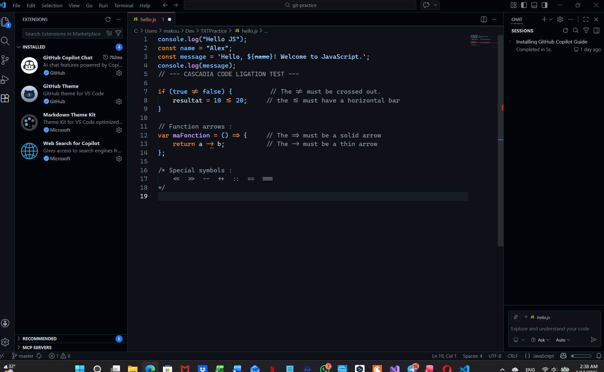
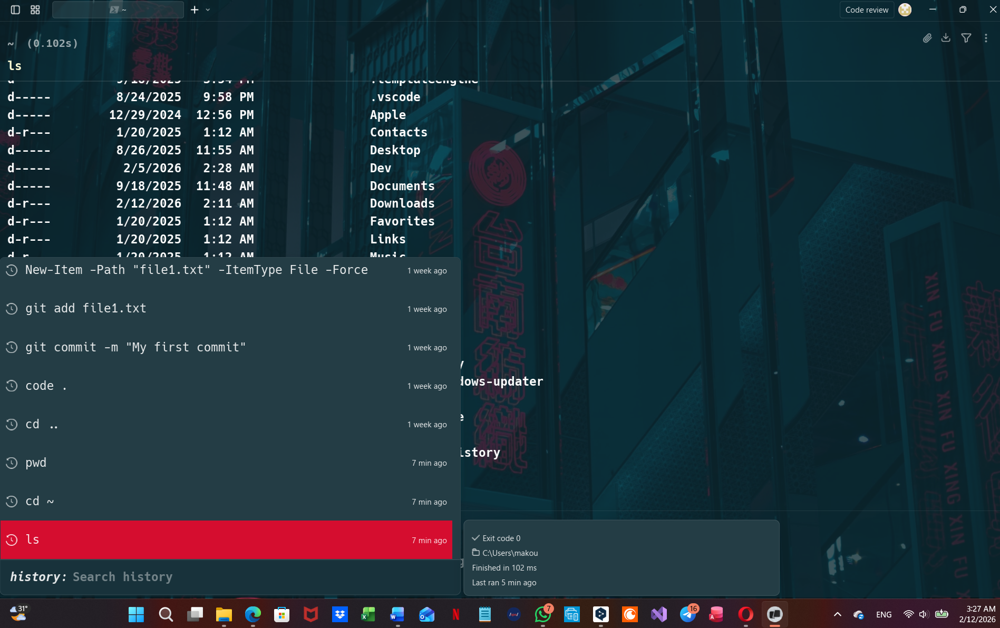
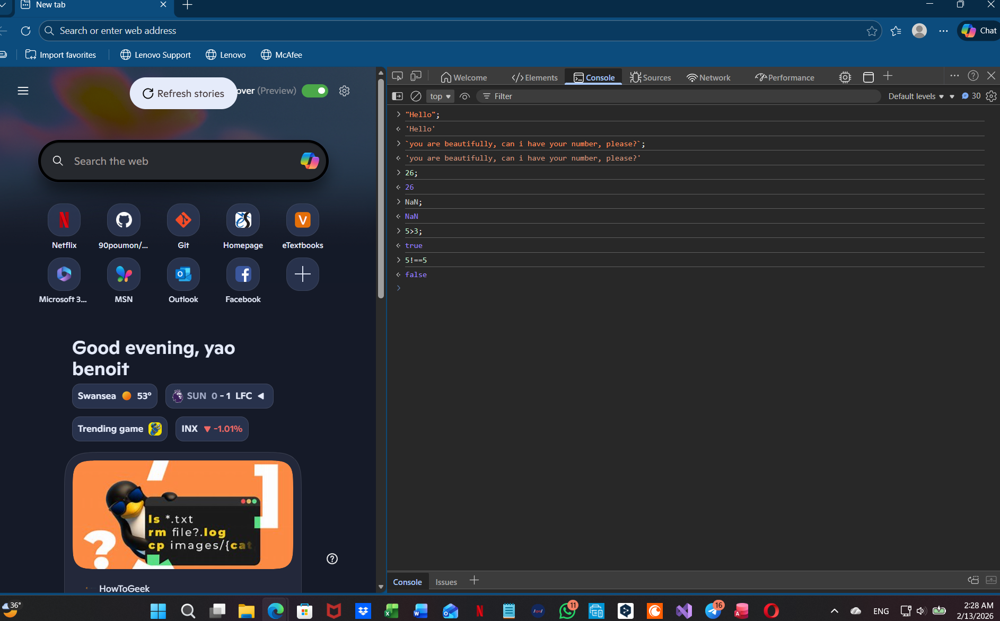
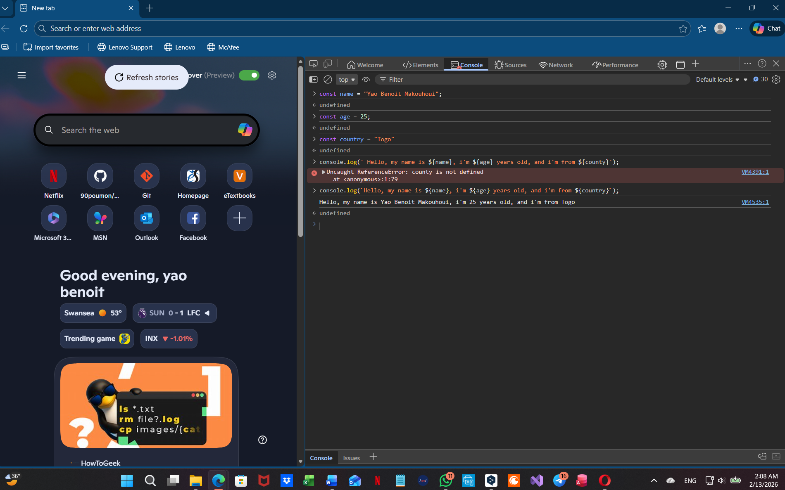
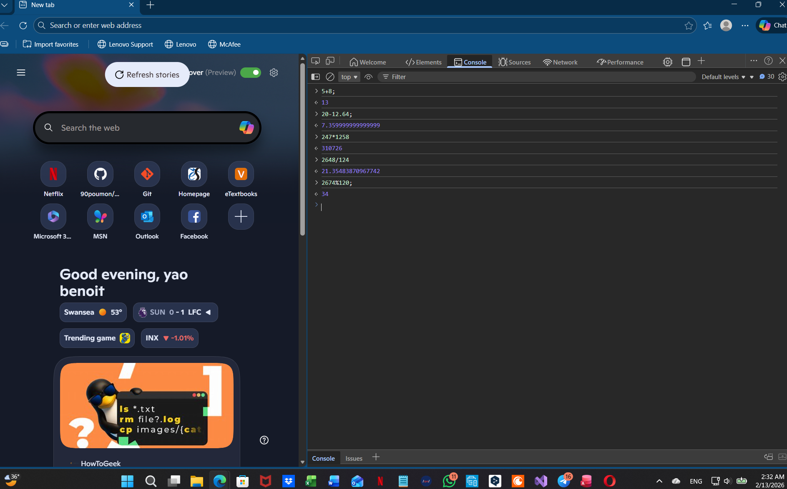
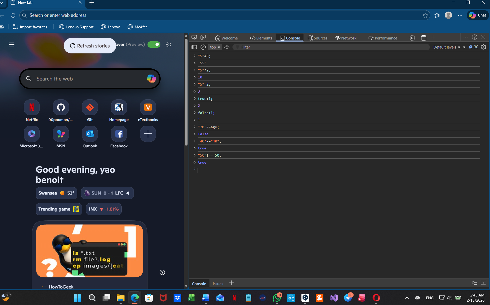
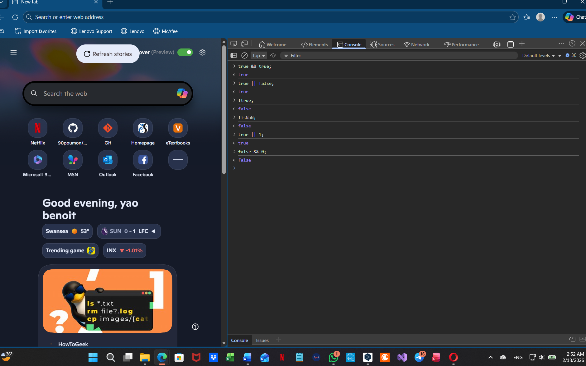

# Development setup & JavaScript Fundamentals

## Part 1: VS Code Setup

### Screenshot

### Reflection
#### Font and Theme Choices
- I chose the **Fira Code** font and the **GitHub Dark Colorblind (Beta)** theme.
    - I chose this font because it's make me easy to read what I type. The font size and spacing allow me to see any mistakes.
    - I chose this theme because it allows me to strain my eyes less and makes it easier for me to read what I type.
- For my part, this configuration works because it allows me to be faster, spot errors quickly, and work smoothly.

## Part 2: Warp Terminal Setup

### Screenshot

### Reflection
#### Input Position
I chose the input position at the **Bottom**.
- I prefer it because I'm more comfortable with it. When I open my warp, my first instinct is to look down.
- Since the initial configuration, my input has always remained at the bottom, so changing its position bothered me a lot, which is why I decided to keep it at the bottom.
#### AI Settings (Cost Efficient)
- We use **Cost Efficient** as the basic AI model rather than the advanced options because it allows for faster execution and saves costs.
- **Example of when I use Warp AI to learn**: when I need to manipulate files for my project “Entre nous la vie” (Between Us, Life), I specify that it is a personal project. Instead of searching on Google, I ask the AI: “How do I create a folder and move all .jpg files into it with a single command?” The AI gives me the command mkdir image name.jpg and explains each part to me. This helps me understand the logic of the command line.
- **Example of when I want to execute a command without AI**: Once I know my basic commands such as **cd, ls, pwd, or git status**, it is better to type them directly. Using AI for repetitive and familiar actions would slow down my progress and memorization. 

## Part 3: JavaScript Fundamentals

### 1.Variable declarations

*I created variable for storing data values in JavaScript.*

### 2.String, number, and boolean examples

*I tested different data types and confirmed how JavaScript displays each one in the console.*

### 3.Template Literals

*I combined multiple variables into a sentence using a template literal with `${}`*

### 4.Arithmetic operators

*I tested basic arithmetic operations like addition, subtraction, multiplication, division, and modulus-remainder.*

### 5.Type coercion experiments

*I tested how JavaScript behaves when mixing strings and number.*

### 6.Comparison operators

*I used comparison operators like `===`, `!==`,`>`, `<`, `>=`, and `<=` to check values in different situations.*

### 7.Logical operators

*I tested logical operators like `&`, `||`,`!` to see how conditions evaluate in JavaScript.*